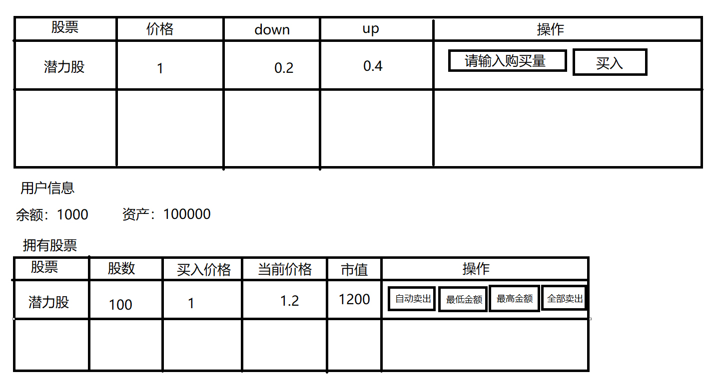

# 要求

请使用 vue.js 组合式API 完成下列要求

- 声明一个用户对象包含以下属性
  ```js
  let user = {
    money: '金钱',
    // 股票表
    ticket: {
        // key: 股票名
        // value: 持有数量
        股票名1: '持有数量1',
        股票名2: '持有数量2',
        ...
    },
  }
  ```
- 制作一个股票列表，包含多只股票可以选择，数据格式如下
  ```js
  let tickets = [
    // 每个成员是一只股票的信息
    {
        name: '股票名',
        price: '当前每股价格',
        down: '股价每次向下波动的金额不能超过该值',
        up: '股价每次向上波动金额不能超过该值'
    }
  ]
  ```
- 将股票循环渲染到页面中,最后列，添加一个操作列，并包括一个输入框和一个买入按钮，输入买入的股数后，就可以购买了
- 将已买入的股票循环渲染，最后列，添加一个操作列，包含以下按钮，卖出: 用于手动卖出当前股票；自动卖出: 开启该按钮后，该股票价格超过设定的最小或最大值会自动卖出，开启后该按钮就变成关闭按钮，再次点击将取消自动卖出功能；两个输入框：用于输入自动卖出的最低价格和最高价格
- 请使用计算属性计算用户当前资产，资产 = 当前手里的钱 + 各个股票的市值和
- 股票每2秒自动波动一次

## 效果图

