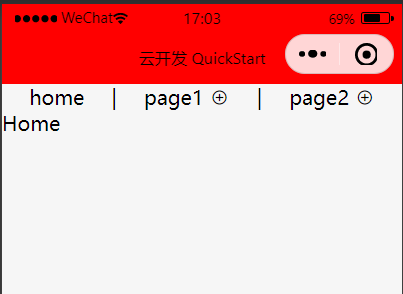
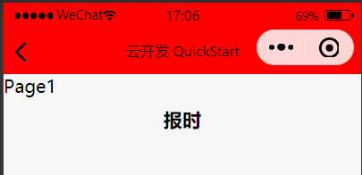
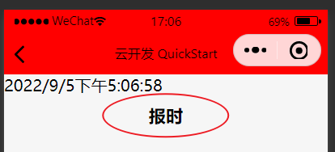
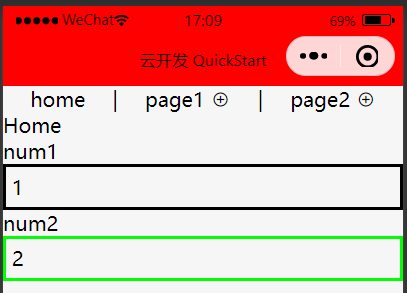
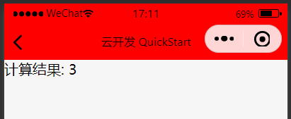

# 要求

开发一个小程序以满足以下需求

1. 创建页面 home page1 page2
2. home 页面创建导航按钮并添加 iconfont 图标
   
3. 在 page1 中 添加按钮，点击后将 page1 的页面名称改为当前时间
   
   
4. 在 home 中加入输入框，输入数字参数
   
5. home 页面点击导航按钮跳转到 page2 并将输入框内的数据传递到 page2，然后 page2 中计算两个数字的和 并显示出来
   